# T3A2-B

Trello: https://trello.com/b/nwC74SxA/t3a2-a-full-stack-app

Repository: https://github.com/miasahra/T3A2-B

Backend: https://feedingtracker-backend.herokuapp.com/

Frontend: https://feeding-tracker-frontend.netlify.app/

## CMP1043-1.3 Appropriate use of libraries used in the app:

The application uses many libraries for both the frontend and backend. These can be defined below:

### Frontend

Frontend libraries include:

- [axios](https://github.com/axios/axios) - Promise based HTTP client for the browser and Node.js. This was used to make requests to the backend API from the frontend.
- [headlessui](https://github.com/tailwindlabs/headlessui) - Fully accessible UI component library, designed to integrate with TailwindCSS. This was used to support the design and reach MVP as quick as possible.
- [tailwindcss](https://github.com/tailwindlabs/tailwindcss) - A utility-first CSS framework for rapid UI development. This was used to support the design and reach MVP as quick as possible.
- [react-router-dom](https://github.com/ReactTraining/react-router#readme) - Declarative routing for React. This was used to handle URL routing with components.
- [eslint](https://github.com/eslint/eslint) - ESLint is a tool for identifying and reporting on patterns found in JavaScript code. This was used to construct consistency through wide app coverage.
- [prop-types](https://github.com/facebook/prop-types) - Runtime type checking for React props and similar objects. This was used to ensure that components were given the correct props and flagged if not.

### Backend

Backend libraries include:

- [bcrypt](https://github.com/kelektiv/node.bcrypt.js/) - A library to help hash passwords. This was used during Authentication to ensure that user passwords were encrypted in the database, which were then decrypted when verifying in a safe manner. 
- [express](https://github.com/expressjs/express) - A fast, unopinionated, minimalist web framework for node. This was used as the Node.js framework where the API was hosted.
- [jsonwebtoken](https://github.com/auth0/node-jsonwebtoken) - A compact, URL-safe means of representing claims to be transferred between a frontend and backend. This was used to authorize user logins/registers, by caching the token in localStorage on the frontend.
- [lodash](https://github.com/lodash/lodash) - A modern JavaScript utility library delivering modularity, performance, & extras. This was used to access developer-friendly helper methods.
- [mongoose](https://github.com/Automattic/mongoose) - MongoDB object modeling designed to work in an asynchronous environment. This was used as an ORM to define the database schema.
- [eslint](https://github.com/eslint/eslint) - ESLint is a tool for identifying and reporting on patterns found in JavaScript code. This was used to construct consistency through wide app coverage.
- [jest](https://github.com/facebook/jest) - Delightful JavaScript Testing. This was used to test and mock API endpoints to ensure data was being sent/received expectedly.
- [nodemon](https://github.com/remy/nodemon) - Monitor for any changes in your node.js application and automatically restart the server. This was used for efficiency/convenience in regards to developer experience, where the backend Node.js server would restart if a file was changed to provide instantaneous results.

## PRG1006-2.1 Employ and utilise proper source control methodology:

Due to working on this project independently, there was no risk of Merge Conflicts or any need for multiple Git branches. 

Git commit practices were used such as `"ADD"`, `"UPDATE"`, `"FIX"`, and `"REMOVE"`, to ensure consistency from a readability point of view. This also helped with looking back on previous commits to find specific code changes.

Commits were made when a _single_ chunk was completed, such as a bugfix, feature or dependency change. This was to ensure that everything being committed was labeled and easy to navigate.

[View Git commit history.](https://github.com/miasahra/T3A2-B/commits/master)

## PRG1006-2.2 Employ and utilise project management methodology:

The Agile methodology was chosen during this application, consisting of both daily and weekly sprints. Weekly cycles revolved around standup for accountability and direction, whereas daily cycles revolved around breaking down the required tasks and solving them effectively. 

[Trello](https://trello.com/b/tzxfJvbH/t3a2-b) was used for this process, which significantly contributed to deadlines and management of the project at a higher level. This included the typical `"To Do"`, `"In Progress"`, `"Blocked"` and `"Done"` columns. These were used throughout the interim of the project on a daily basis to stay organised. 

## PRG1006-2.3 Employ and utilise task delegation methodology:

Due to working on this project independently, task delegation was not a requirement. Upon commencing the project, I distinguished my strengths and weaknesses which led to things such as the chosen tech stack and experience with libraries/frameworks that I utilised.

I did however need to keep myself in check as I did not have anyone to delegate to, which is where I heavily depended on the Agile methodology.

## PRG1006-6.2 Deployment:

The application has been deployed via Heroku. Both separately such as the client and server. This has been done via Heroku-CLI, a command line tool that integrates with a Git repository. The client points to the servers address, so that all data is maintained within the deployed app.

Backend: https://feedingtracker-backend.herokuapp.com/

Frontend: https://feedingtracker-frontend.herokuapp.com/

## PRG1006-6.3 User interface:

The user interface is intuitive with a great user flow. It has been designed with minimalism and simplicity in mind, which is why only _few_ pages exist to achieve the products desired outcome.

A few key points include:

- Fully accessible components have been used to ensure that components are completely useable on any browser or device.
- Labels are associated with inputs for readability and suggestions.
- Consistent brand colours.
- Fully responsive for any device viewport.
- Maintainable code quality.

Screenshots of the design can be shown below:

### Login Page:
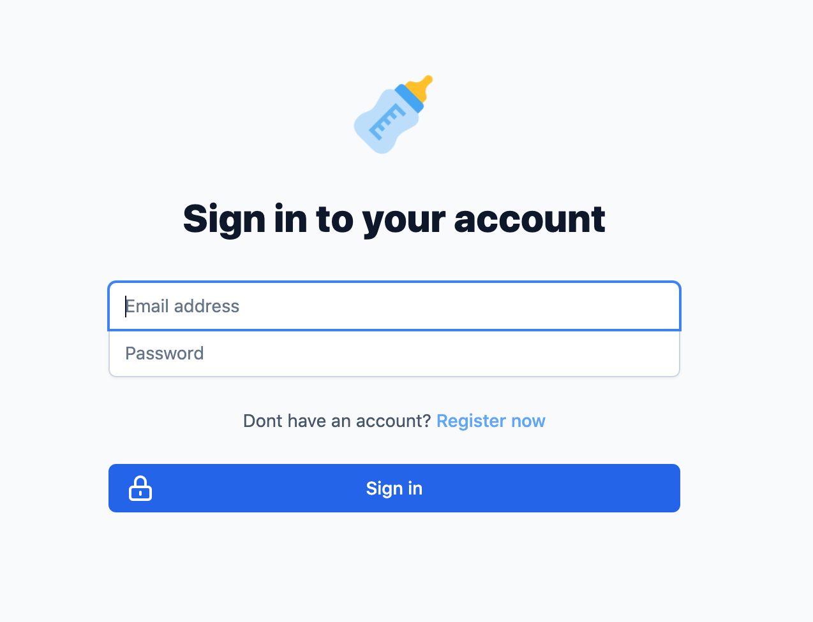

### Register Page:
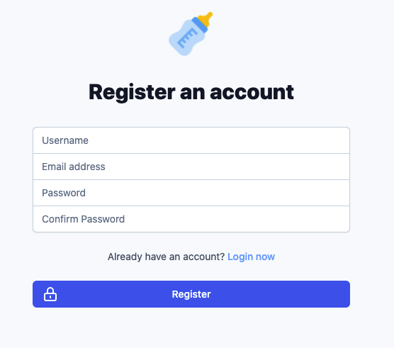

### Dependants/Account page:
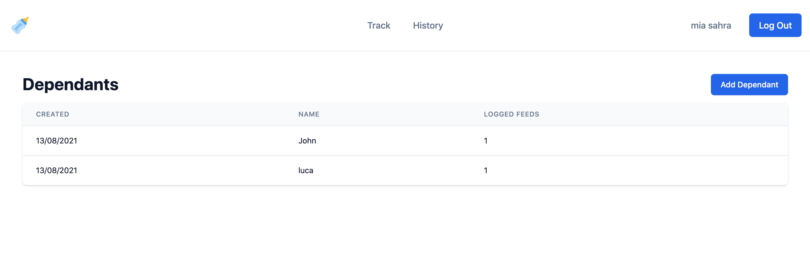

### Add Dependant modal:
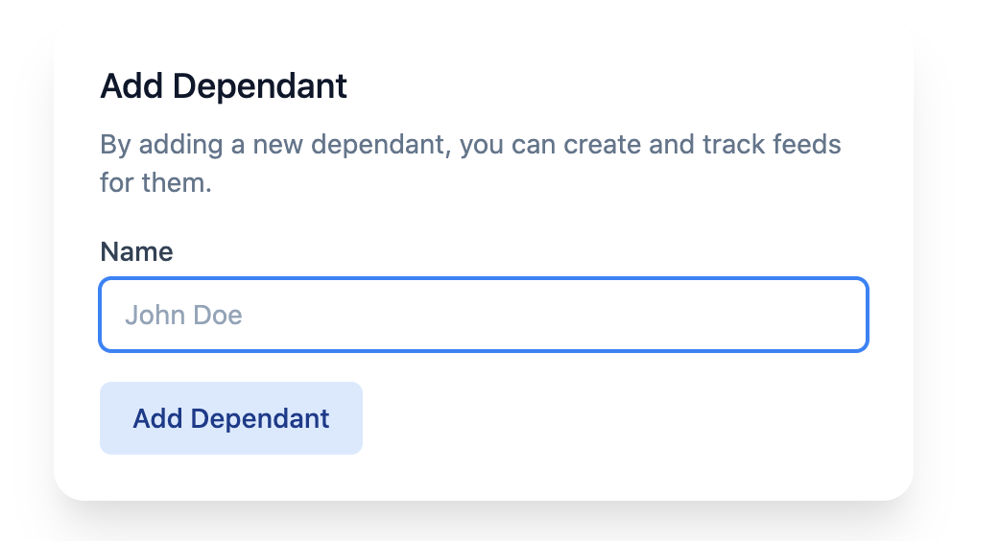

### History Page:
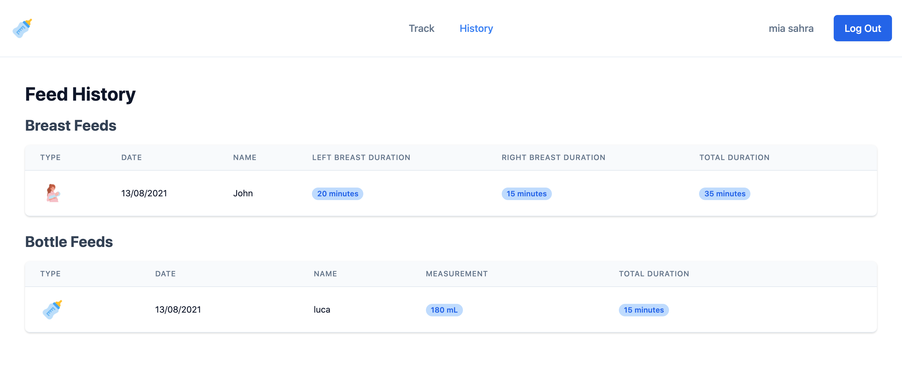

### Dashboard - Bottle:
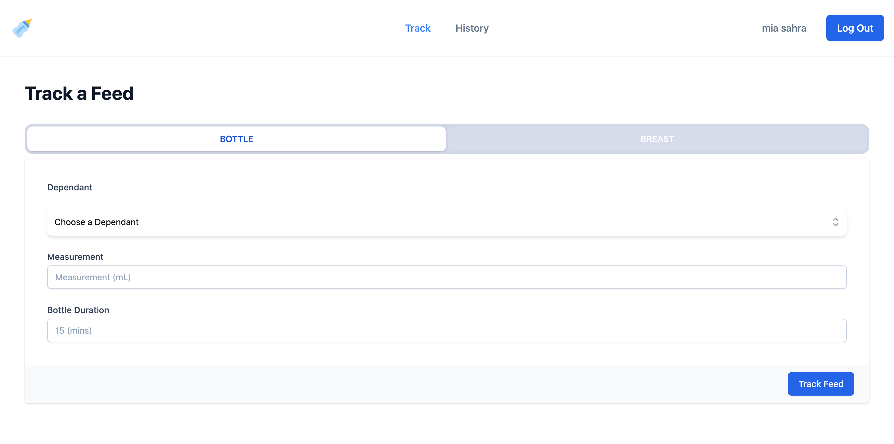

### Dashboard - Breast:
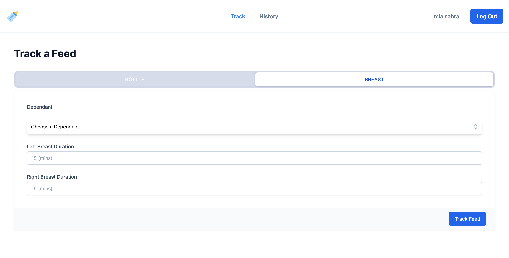

### Dashboard - Responsive Design:
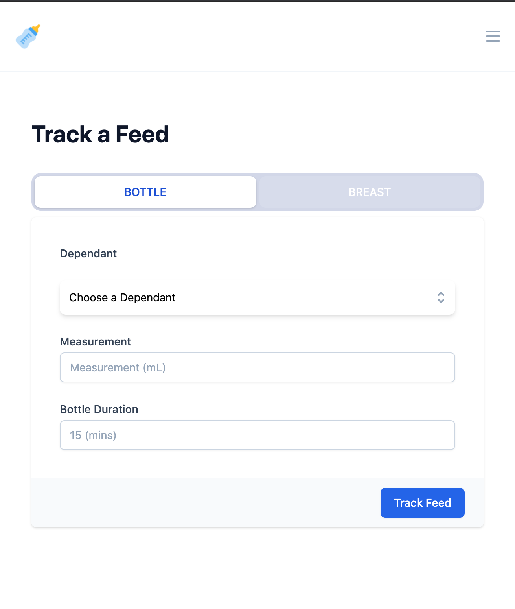

### Navigation Bar - Responsive Mobile:
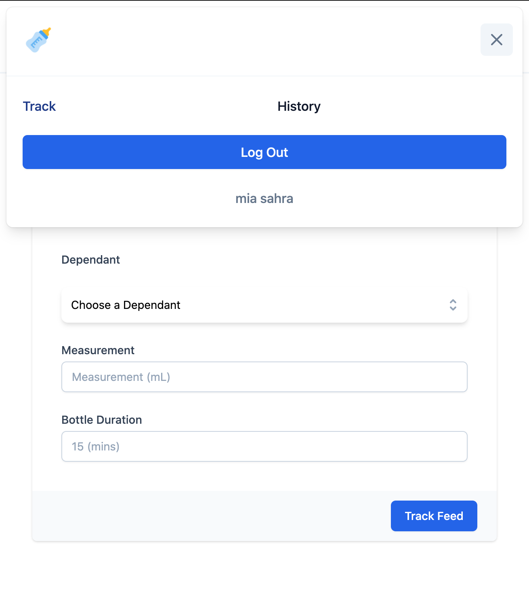

## PRG1006-7.1 Development testing:

User testing was completed throughout the projects development cycle to iterate and refine the overall product. Multiple candidates took part of this experience so that a large enough sample space of data was gathered to make informed decisions on. This was done by using pre-defined user stories as defined in Part A (Q4) below, which each candidate replicated the same workflows under the same constraints - and provided feedback.

To reiterate these:

### As a parent, I want to be able to log feeds so that I can form a routine.
- **Vicki**:
  - Liked how the first page to render if logged in is the tracking page - fast and easy.

- **Courtney**:
  - Did not like that they were required to register if they did not have an account.

- **Tracey**:
  - Wouldn't change anything with tracking. Loved it

### As a parent, I want to be able to form a schedule so that I can make - my life easier.

- **Vicki**:
  - History was useful to view past feed times in case she forgot.

- **Courtney**:
  - Would of liked if it showed a "mean" or "average" for times, measurements, etc to help with forming a schedule.

- **Tracey**:
  - Felt like a "time in mind" such as 8pm for example was better than going off of the average feeding times.

### As a parent, I want to track the data of a feed to make better - informed decisions around my baby's health. 

- **Vicki**:
  - Liked how the breast/bottle feeding categories were separated on the History page as she supplement feeded and preferred them distinguished.

- **Courtney**:
  - Liked the data shown in History but would prefer more graphical representations.

- **Tracey**:
  - Would prefer if there was a feature to export the History data to a CSV file.

### As a parent, I want the option to include measurements of formula/- breast milk per feeding session so that I can monitor the baby's growth.

- **Vicki**:
  - Liked how you can toggle between breast and bottle feed types.

- **Courtney**:
  - Didn't include measurement for breast milk but didn't know why you would need it.

- **Tracey**:
  - No feedback, loved it.

### As a mother, I want to be able to time feeds for both breasts - alternatively in a singular feeding session.

- **Vicki**:
  - Loved it

- **Courtney**:
  - Found it really really useful, although a "automated clock feature" would have been preferable to manual inputs.

- **Tracey**:
  - Loved it,

### As a father, I want to determine how long my baby feeds for so that I can compare formula feeding to breastfeeding.

- **Nathan**:
  - Great for distinguishing differences between the time awake his partner is at night compared to when he is awake and bottle feeds.

## PRG1006-7.2 Production testing:

Different to development testing, production testing was completed only recently (once the application was deployed live). This process consisted of sending the deployed app link to the same candidates from the development testing to ensure consistency. The same pre-defined user stories as defined in Part A (Q4) below were used, which each candidate replicated the same workflows under the same constraints - and provided feedback.

To reiterate these:

### As a parent, I want to be able to log feeds so that I can form a routine.
- **Vicki**:
  - Liked how they stay logged in on refresh and even if they close their computer down.

- **Courtney**:
  - Loved current state of the product for logging.

- **Tracey**:
  - Wouldn't change anything.

### As a parent, I want to be able to form a schedule so that I can make - my life easier.

- **Vicki**:
  - Used it in her daily life and found it is helping her find the most optimal, "natural" times.

- **Courtney**:
  - Finding it hard to find averages, having to do it manually for now.

- **Tracey**:
  - Love the design. Easy to use.

### As a parent, I want to track the data of a feed to make better - informed decisions around my baby's health. 

- **Vicki**:
  - Loved the new design of the tables.

- **Courtney**:
  - Prefer graphical (graphs, line charts, etc) representations.

- **Tracey**:
  - Pitched an export/download to CSV feature.

### As a parent, I want the option to include measurements of formula/- breast milk per feeding session so that I can monitor the baby's growth.

- **Vicki**:
  - Loves the versatility/flexibility.

- **Courtney**:
  - Prefers older design.

- **Tracey**:
  - No feedback.

### As a mother, I want to be able to time feeds for both breasts - alternatively in a singular feeding session.

- **Vicki**:
  - Uses it daily and loves it!

- **Courtney**:
  - Uses separate timer app and records entry manually.

- **Tracey**:
  - Thinks its really useful and prefers new design over old.

### As a father, I want to determine how long my baby feeds for so that I can compare formula feeding to breastfeeding.

- **Nathan**:
  - Loves it, works well for his schedule.

# T3A2-A

## Q1. Description of your website, including:

### Purpose: 
The purpose of this application is to help parents navigate their infant feeding journey by providing convenience and information through tracking functionality. A user will be able to log the duration, measurements, frequency and time intervals between feeds to help make informed decisions around habits and schedules. This will as a result create a happier and healthier relationship with feeding. 

### Functionality / features:
The application will include features that contribute to the user achieving the defined purpose. These can be listed below:
- Register/login capability to save tracking data within the application. This will be optional so that guests that are visiting the site can still utilise the features.
- Tracking page where the user will be able to interact with buttons to simulate their feeding session, with optional inputs such as measurements for bottle feeding and breast swapping. Each tracked session will record the duration, measurements, frequency and time intervals of each feed as defined in the purpose.
  - Having an option to manually input a feeding session in case the user forgot to log a feed.
- History page which will display past feeding session data in a readable format such as perhaps a graph, chart, etc. This data will be succinct enough so that it is very easy for the user to take understandings out of. With this data, the application can also include mathematically calculated takeaways such as averages, mean and medians for factors such as the stated below durations, measurements, frequency and time intervals. This will consequently show a trend that the user can use for growth.
- User account page which displays their account information.
  - Allows a user to create multiple dependents so they can track not only one child, but multiple at once. This is to account for larger families and also parents with twins/triplets/etc.

### Target audience:
The target demographic for this app are parents or guardians who both breastfeed and bottle feed children. This is to ensure all parents are included and there is not a controversial influence such as only breastfeeding. Additionally, this is to attract a larger demographic and therefore generate more traffic. 

### Tech stack: 
The application tech stack consists of a MERN (MongoDB, Express.js, React.js, Node.js) stack. This is Express.js and Node.js as the backend, MongoDB as the database and React.js as the frontend. Mongoose will be used as an ORM to convert information from the database to the JavaScript application. Heroku will be used for deployment. 

## Q2. Dataflow Diagram:
The dataflow diagram for this application has been created in Draw.io and can be showcased below:
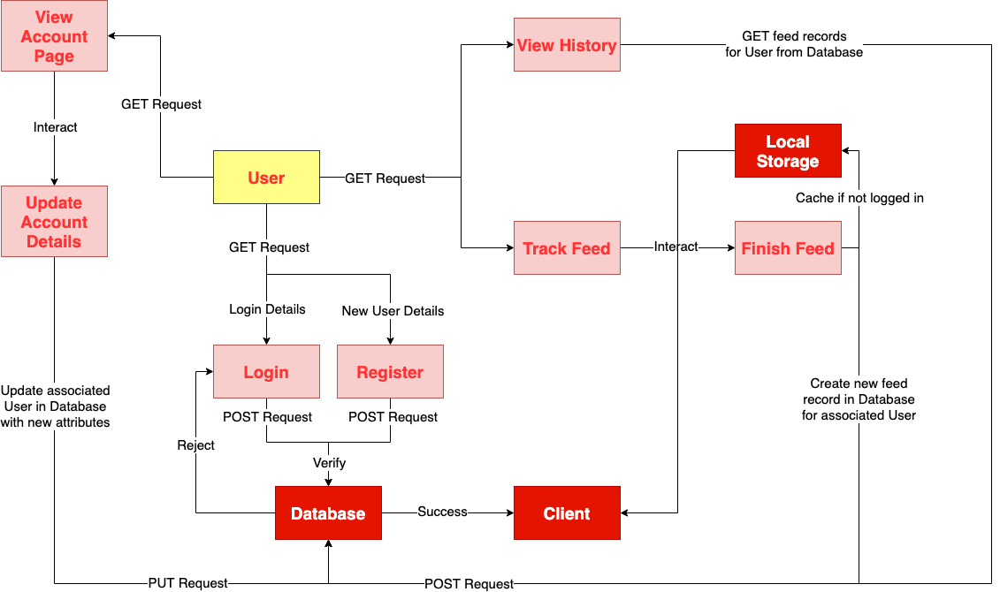

The diagram demonstrates how each component of the application interact with one another, starting from the User workflow. To further understand how these components will interact, refer to the completed Wireframes. 

## Q3. Application Architecture Diagram:
The application architecture diagram for this application has been created in Draw.io and can be showcased below:
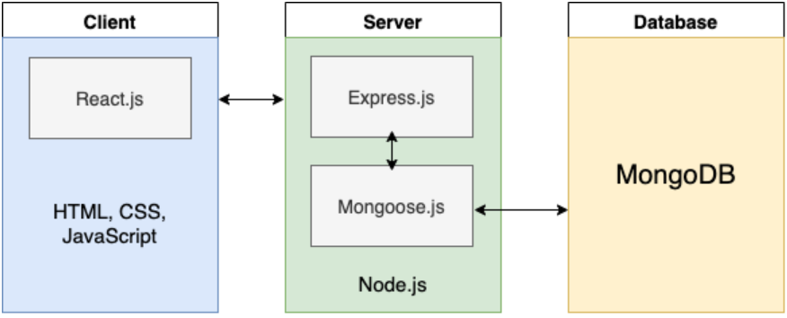

The MERN stack follows the 3-tier architectural pattern. These include the frontend tier (React.js), application/backend tier (Express.js and Node.js), and database tier (MongoDB). These have been elaborated on as defined in the Tech Stack section of this document.

In this architectural pattern, the client (React.js) talks to the backend (Express.js) via API endpoint requests that are defined which utilises the ORM (Mongoose.js) to make requests to the database (MongoDB) in a JavaScript format. 

By doing this, multiple users can use this application at the same time and the server will handle multiple API requests at a given time.

## Q4. User Stories: 

The following user stories are used to define application requirements including features and considerations:

- As a parent, I want to be able to log feeds so that I can form a routine.
- As a parent, I want to be able to form a schedule so that I can make my life easier.
- As a parent, I want to track the data of a feed to make better informed decisions around my baby's health. 
- As a parent, I want the option to include measurements of formula/breast milk per feeding session so that I can monitor the baby's growth.
- As a mother, I want to be able to time feeds for both breasts alternatively in a singular feeding session.
- As a father, I want to determine how long my baby feeds for so that I can compare formula feeding to breastfeeding.

## Q5. Wireframes for multiple standard screen sizes, created using industry standard software:

## Q6. Screenshots of your Trello board throughout the duration of the project:
[A link to Trello board can be found here](https://trello.com/b/nwC74SxA/t3a2-a-full-stack-app).

A Trello board was used as project management software for this task. Throughout the planning phase, it was iteratively developed to avoid scope creep and stay on task as per the documentation requirements. Screenshots of the Trello board can be shown below, and are in order of completion to showcase processes and iteration of the project.

### Create Trello Board:
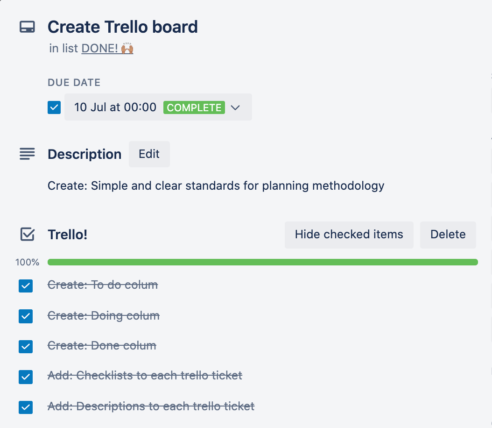

### Initialize Git Repository:
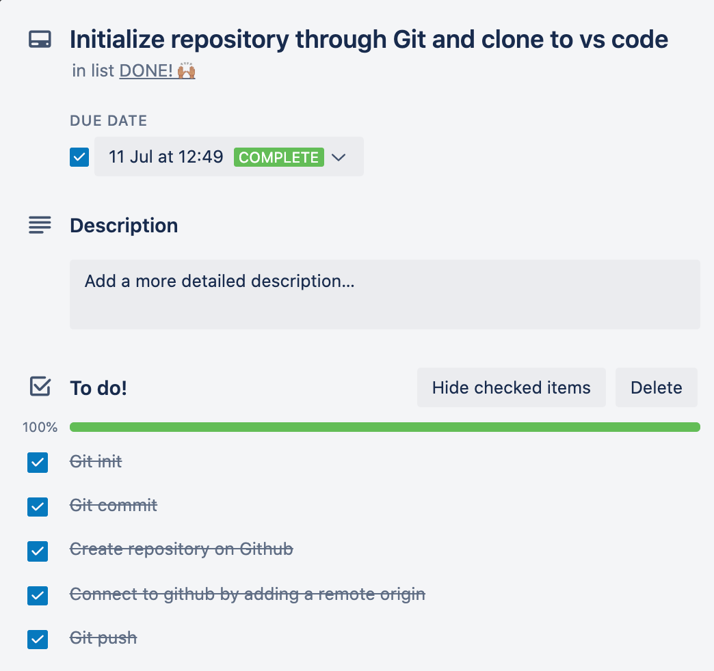

### Brainstorm Ideas:
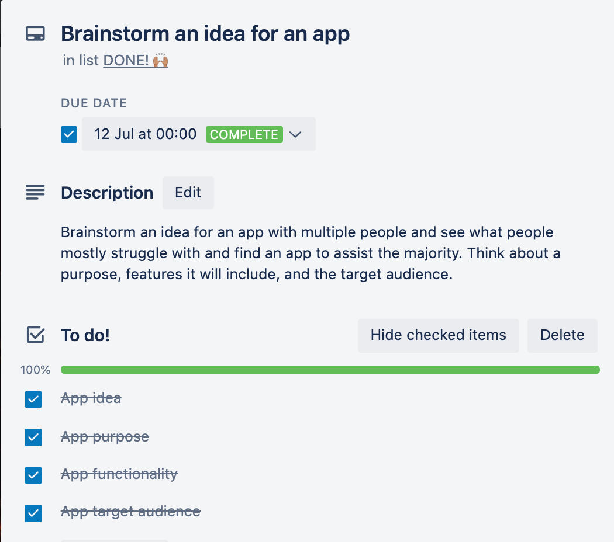

### User Stories:
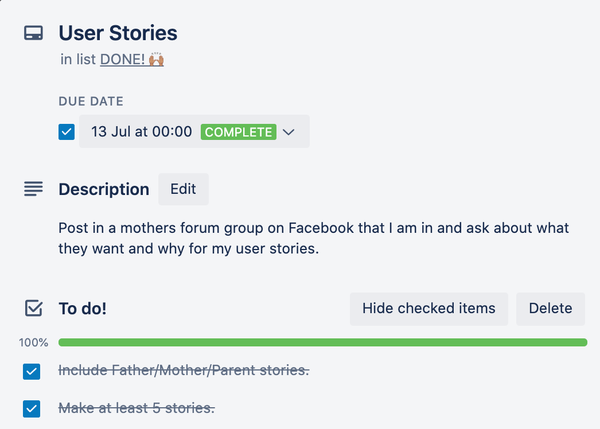

### Brainstorm Design:
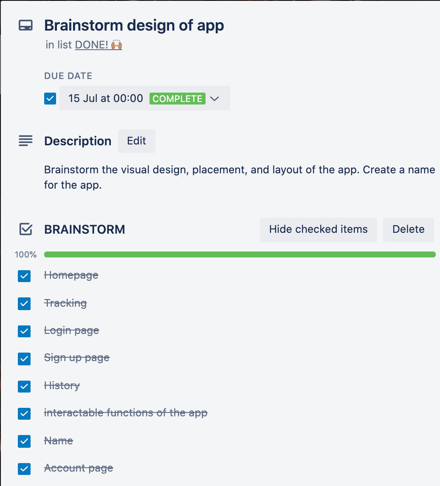

### Create Wireframes:
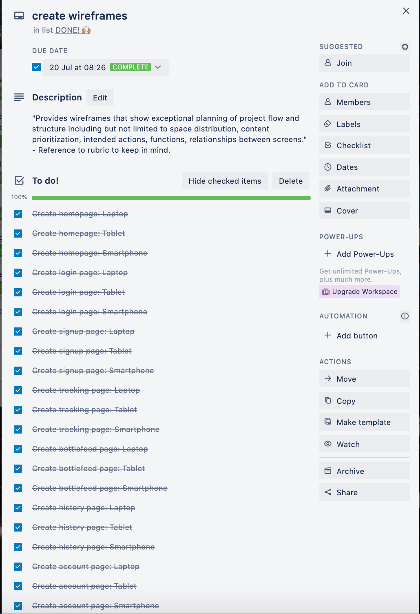

### Create Application Architecture Diagram:
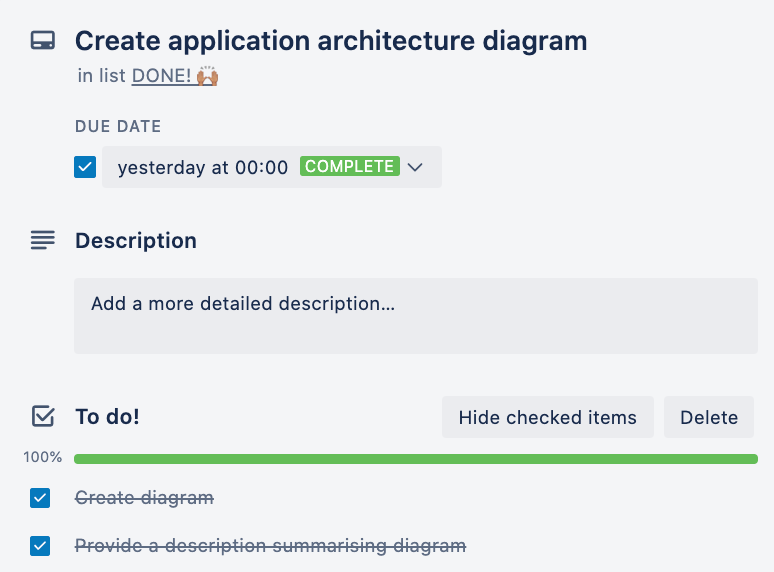

### Create Dataflow Diagram:
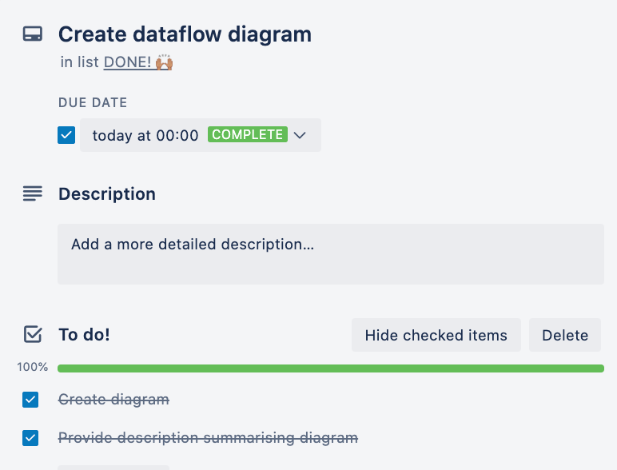

